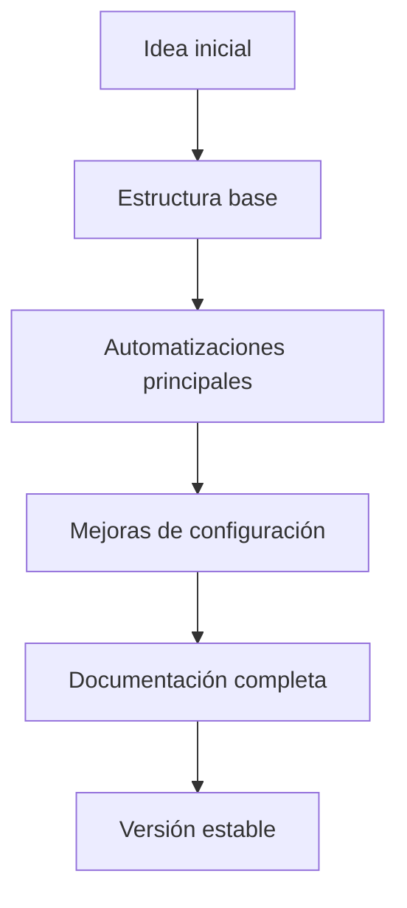

<div align="center">

# 🚀 AutoFull

### Automatización simple, rápida y eficiente para potenciar flujos de trabajo full-stack.


</div>

---

## 📌 Sobre el proyecto

**AutoFull** es un proyecto orientado a automatizar tareas repetitivas dentro de un flujo de desarrollo, buscando reducir tiempo manual, mejorar la organización y facilitar procesos que normalmente requieren múltiples pasos.

La idea principal del proyecto es centralizar y simplificar acciones que suelen repetirse durante el desarrollo, permitiendo trabajar de forma más rápida, ordenada y eficiente.

> Proyecto en desarrollo. La estructura y funcionalidades pueden evolucionar con el tiempo.

---

## ✨ Características principales

* ⚡ Automatización de tareas repetitivas.
* 🧩 Enfoque práctico y modular.
* 🛠️ Pensado para mejorar flujos de trabajo de desarrollo.
* 📁 Organización clara del proyecto.
* 🚀 Base adaptable para seguir incorporando funcionalidades.
* 🧠 Ideal como proyecto de aprendizaje, portfolio y experimentación técnica.

---

## 🧰 Tecnologías

> Actualizar esta sección según el stack real del proyecto.

<div align="center">


</div>

---

## 📂 Estructura del proyecto

```bash
AutoFull/
├── src/              # Código fuente principal
├── docs/             # Documentación del proyecto
├── scripts/          # Scripts de automatización
├── assets/           # Imágenes, logos o recursos visuales
├── README.md
└── ...
```

> La estructura puede variar según la implementación actual del proyecto.

---

## 🚀 Instalación y uso

Cloná el repositorio:

```bash
git clone https://github.com/Aznar-7/AutoFull.git
```

Entrá al proyecto:

```bash
cd AutoFull
```

Instalá las dependencias según corresponda:

```bash
npm install
```

o, si el proyecto usa Python:

```bash
pip install -r requirements.txt
```

Ejecutá el proyecto:

```bash
npm run dev
```

o:

```bash
python main.py
```

---

## ⚙️ Configuración

Si el proyecto requiere variables de entorno, crear un archivo `.env` en la raíz:

```env
API_KEY=your_api_key_here
DATABASE_URL=your_database_url_here
```

> No subir claves privadas ni credenciales reales al repositorio.

---

## 🧪 Funcionalidades previstas

* [ ] Automatización de tareas base.
* [ ] Mejora de estructura interna.
* [ ] Documentación de comandos principales.
* [ ] Manejo de configuración mediante variables de entorno.
* [ ] Interfaz o CLI para facilitar el uso.
* [ ] Tests básicos.
* [ ] Deploy o empaquetado final.

---

## 📸 Preview

<div align="center">

<!-- Agregar imagen, gif o captura del proyecto cuando esté disponible -->


</div>

---

## 🧠 Aprendizajes del proyecto

Este proyecto busca reforzar conceptos como:

* Automatización de procesos.
* Organización de proyectos reales.
* Buenas prácticas de desarrollo.
* Uso de scripts y herramientas externas.
* Documentación clara y mantenible.
* Preparación de proyectos para portfolio profesional.

---

## 🗺️ Roadmap



---

## 🤝 Contribuciones

Las contribuciones, ideas y mejoras son bienvenidas.

Para contribuir:

1. Hacer fork del repositorio.
2. Crear una nueva rama:

```bash
git checkout -b feature/nueva-funcionalidad
```

3. Realizar los cambios.
4. Crear un commit:

```bash
git commit -m "feat: add nueva funcionalidad"
```

5. Subir la rama:

```bash
git push origin feature/nueva-funcionalidad
```

6. Abrir un Pull Request.

---

## 👨‍💻 Autor

Desarrollado por **Vicente Aznar**.

<div align="center">

[](https://github.com/Aznar-7)
[](https://vicenteaznar.dev)

</div>

---

## ⭐ Apoyo

Si el proyecto te resulta interesante, podés dejar una estrella en el repositorio:

<div align="center">

### ⭐ `Aznar-7/AutoFull`

</div>

---

<div align="center">

**AutoFull** — Automatizá más. Repetí menos.

</div>
